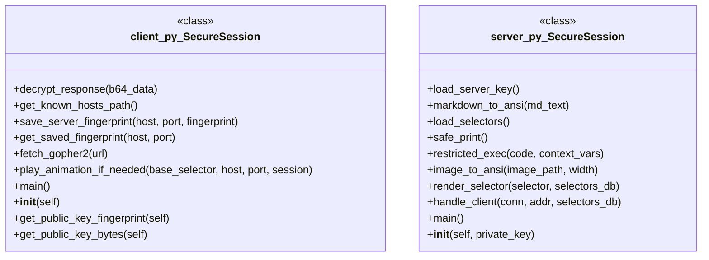

# Polyglot Codebase Knowledge Graph

> Generated offline by **readmenator**. 5 files, 40 symbols, 40 imports. Supports C, C++, Python, Go, Rust, JS/TS, Java, C#, Shell, PHP, Dart, GDScript, Nim, ASM, Ruby, Swift, Kotlin, Scala, Lua, Elixir.
> No LLMs. No tokens. Pure static analysis. See more [here](https://github.com/grisuno/ReadMenator)

**Start here:** Statistics Dashboard for scope, God Nodes for blast radius, Architecture Reference for per-file API. Agents: prefer `readmenator-agent/INDEX.md` + `SYMBOLS.md`.

**Wiki:** prefer `readmenator-wiki/index.md` for progressive disclosure: one synthesis page per community, `connections.json` with EXTRACTED vs INFERRED confidence, `queries.md` log, `REPORT.md` audit.

**Confidence:** EXTRACTED = parsed from source, INFERRED = heuristic bridge, AMBIGUOUS = reported, never hidden. See `readmenator-wiki/REPORT.md`.

**Total Files Parsed:** 5 | **Total Symbols Extracted:** 40 | **Total Imports:** 40
 | **Resolved Imports:** 1

<!-- ranking_model: v1.0 | weights: {ppr:0.45,auth:0.2,test:0.15,doc:0.1,fresh:0.1} | alpha:0.85 | commit:b3ca3bb | date:2026-07-18 -->


## Table of Contents

1. [Statistics Dashboard](#statistics-dashboard)
2. [Architectural Layers](#architectural-layers)
3. [Ranked Context](#ranked-context)
4. [God Nodes](#god-nodes)
5. [Community Analysis](#community-analysis)
6. [Suggested Questions](#suggested-questions)
7. [Hotspot Analysis](#hotspot-analysis)
8. [Change Impact Analysis](#change-impact-analysis)
9. [Suggested Linting Rules](#suggested-linting-rules)
10. [Dataflow Analysis](#dataflow-analysis)
11. [Query Recipes](#query-recipes)
12. [Structural Knowledge Map](#structural-knowledge-map)
13. [UML Class Diagram](#uml-class-diagram)
14. [Code Property Graph](#code-property-graph)
15. [Architecture Reference](#architecture-reference)
    - [PY (4 files)](#py-4-files)
    - [SH (1 files)](#sh-1-files)

---

## Statistics Dashboard

| Metric | Value |
|--------|-------|
| Total Files | 5 |
| Total Symbols | 40 |
| Total Imports | 40 |
| Call Edges | 365 |
| Inheritance Edges | 0 |
| Languages | 2 |
| Avg Symbols/File | 8.0 |
| Avg Imports/File | 8.0 |
| Resolved Imports | 1 |

### Top Files by Import Count (Fan-Out)

| File | Imports | Symbols | Language |
|------|---------|---------|----------|
| `server.py` | 20 | 17 | py |
| `client.py` | 16 | 14 | py |
| `ansi_widgets.py` | 3 | 7 | py |
| `app.py` | 1 | 0 | py |

---

## Architectural Layers

Auto-detected from path patterns, naming conventions, and imported frameworks.

| Layer | Files |
|-------|-------|
| utility | 3 |
| presentation | 1 |
| infrastructure | 1 |

### presentation

- `ansi_widgets.py` (py, 7 symbols)

### utility

- `app.py` (py, 0 symbols)
- `install.sh` (sh, 2 symbols)
- `server.py` (py, 17 symbols)

### infrastructure

- `client.py` (py, 14 symbols)

---

## Ranked Context

Files ranked by composite score for the current query context. The ranking combines Personalized PageRank (query relevance), global authority, test coverage, documentation coverage, and code freshness. Model: v1.0.

| Rank | File | Composite | PPR | Authority | Test | Doc |
|------|------|-----------|-----|-----------|------|-----|
| 1 | `ansi_widgets.py` | 0.4362 | 0.6491 | 0.6491 | 0.00 | 0.14 |
| 2 | `server.py` | 0.2340 | 0.3509 | 0.3509 | 0.00 | 0.06 |
| 3 | `app.py` | 0.1000 | 0.0000 | 0.0000 | 0.00 | 1.00 |
| 4 | `client.py` | 0.0643 | 0.0000 | 0.0000 | 0.00 | 0.64 |
| 5 | `install.sh` | 0.0500 | 0.0000 | 0.0000 | 0.00 | 0.50 |

---

## God Nodes

Most architecturally central files ranked by combined import/export degree and symbol richness.

| File | Score | Connections | PageRank |
|------|-------|-------------|----------|
| `server.py` | 3.7 | | 0.3509 |
| `ansi_widgets.py` | 2.7 | | 0.6491 |
| `client.py` | 1.4 | | 0.0000 |
| `install.sh` | 0.2 | | 0.0000 |
| `app.py` | 0.0 | | 0.0000 |

---

## Community Analysis

Files grouped by import-based community detection. Cohesion measures how tightly connected each community is internally.

### root (Cohesion: 1.00)

**2 files** in this community:

- `ansi_widgets.py` (py, 7 symbols)
- `server.py` (py, 17 symbols)

---

## Suggested Questions

Auto-generated exploration prompts based on graph structure:

- What does server.py depend on, and what depends on it? (1 connections)
- What does ansi_widgets.py depend on, and what depends on it? (1 connections)
- What does client.py depend on, and what depends on it? (0 connections)
- What is SecureSession in client.py and how is it used?
- What is SecureSession in server.py and how is it used?

---

## Hotspot Analysis

Files ranked by combined complexity (symbol count) and centrality (connection count). High-scoring files are architecturally critical and may need refactoring attention.

| File | Complexity | Centrality | Combined | Symbols | Connections |
|------|-----------|------------|----------|---------|-------------|
| `ansi_widgets.py` | 0.412 | 0.191 | 0.279 | 7 | 4 |
| `server.py` | 1.000 | 1.000 | 1.000 | 17 | 21 |
| `app.py` | 0.000 | 0.048 | 0.029 | 0 | 1 |
| `client.py` | 0.824 | 0.762 | 0.787 | 14 | 16 |
| `install.sh` | 0.118 | 0.000 | 0.047 | 2 | 0 |

---

## Dataflow Analysis

Procedural intra-function dataflow findings (zero tokens, regex-based heuristics, all INFERRED). Each lead is grounded at file:line for manual review.

**2 findings** (UNCHECKED_ALLOC: 2).

| File | Function | Line | Kind | Variable | Description |
|------|----------|------|------|----------|-------------|
| `server.py` | `image_to_ansi` | 276 | `UNCHECKED_ALLOC` | `img` | Result of allocator stored in `img` is never checked against NULL. |
| `server.py` | `main` | 451 | `UNCHECKED_ALLOC` | `sock` | Result of allocator stored in `sock` is never checked against NULL. |

---

## Change Impact Analysis

Files sorted by how many other files would be affected if they changed. High-impact files should be changed with caution.

| File | Direct Dependents | Transitive Dependents | Total Impact |
|------|------------------|----------------------|--------------|
| `ansi_widgets.py` | 1 | 0 | 1 |
| `app.py` | 0 | 0 | 0 |
| `client.py` | 0 | 0 | 0 |
| `install.sh` | 0 | 0 | 0 |
| `server.py` | 0 | 0 | 0 |

---

## Suggested Linting Rules

Automatically suggested linting and security rules based on patterns detected in the codebase. These can be exported as Semgrep rules using the `--export-rules` flag.

| Rule ID | Severity | Description | Language | Matches |
|---------|----------|-------------|----------|---------|
| `RM001` | info | Large number of functions in py: 36 total | py | 36 |
| `RM002` | info | Print statement found (consider logging instead) | python | 13 |

---

## Query Recipes

Example queries you can run against this knowledge base using the ranking engine:

```
# Find files most relevant to a concept
readmenator query "Where is the import resolver implemented?"

# Rank files by relevance to a topic
readmenator query "How does documentation generation work?"

# Explain why a file ranks highly
readmenator query "explain readmenator/_documentation.py"

# Trace dependency paths with ranked context
readmenator query "path from CLI to exporter"
```

The ranking model uses the following signals:

- **Personalized PageRank** (45% weight): query-specific relevance via seed propagation
- **Global Authority** (20% weight): structural importance via standard PageRank
- **Test Coverage** (15% weight): fraction of symbols referenced in test files
- **Doc Coverage** (10% weight): presence of docstrings and file-level docs
- **Freshness** (10% weight): recent modification activity

Results include score decomposition and justification paths for each ranked item.

---

## Structural Knowledge Map

```mermaid
graph TD
    classDef mod fill:#1e1e1e,stroke:#ff6666,stroke-width:2px,color:#fff;
    classDef cls fill:#2d2d2d,stroke:#4ec9b0,stroke-width:2px,color:#fff;
    classDef fn fill:#333,stroke:#dcdcaa,stroke-width:1px,color:#dcdcaa;
    classDef ext fill:#111,stroke:#666,stroke-dasharray:5 5,color:#aaa;
    subgraph community_0 ["root"]
    server_py["server.py (py)"]
    class server_py mod;
    server_py_SecureSession["SecureSession"]
    class server_py_SecureSession cls;
    server_py --> server_py_SecureSession
    server_py_load_server_key["load_server_key"]
    class server_py_load_server_key fn;
    server_py --> server_py_load_server_key
    server_py_markdown_to_ansi["markdown_to_ansi"]
    class server_py_markdown_to_ansi fn;
    server_py --> server_py_markdown_to_ansi
    server_py_load_selectors["load_selectors"]
    class server_py_load_selectors fn;
    server_py --> server_py_load_selectors
    server_py_safe_print["safe_print"]
    class server_py_safe_print fn;
    server_py --> server_py_safe_print
    client_py["client.py (py)"]
    class client_py mod;
    ansi_widgets_py["ansi_widgets.py (py)"]
    class ansi_widgets_py mod;
    app_py["app.py (py)"]
    class app_py mod;
    install_sh["install.sh (sh)"]
    class install_sh mod;
    end
    server_py -- resolved_imports --> ansi_widgets_py
    ext_time["time"]
    class ext_time ext;
    ansi_widgets_py -.->|imports| ext_time
    ext_math["math"]
    class ext_math ext;
    ansi_widgets_py -.->|imports| ext_math
    ext_typing["typing"]
    class ext_typing ext;
    ansi_widgets_py -.->|imports| ext_typing
    ext_os["os"]
    class ext_os ext;
    app_py -.->|imports| ext_os
    ext_socket["socket"]
    class ext_socket ext;
    client_py -.->|imports| ext_socket
    ext_sys["sys"]
    class ext_sys ext;
    client_py -.->|imports| ext_sys
    ext_base64["base64"]
    class ext_base64 ext;
    client_py -.->|imports| ext_base64
    ext_argparse["argparse"]
    class ext_argparse ext;
    client_py -.->|imports| ext_argparse
    ext_logging["logging"]
    class ext_logging ext;
    client_py -.->|imports| ext_logging
    ext_urllib_parse["urllib.parse"]
    class ext_urllib_parse ext;
    client_py -.->|imports| ext_urllib_parse
    ext_cryptography_hazmat_primitives_ciphers_aead["cryptography.hazmat.primitives.ciphers.aead"]
    class ext_cryptography_hazmat_primitives_ciphers_aead ext;
    client_py -.->|imports| ext_cryptography_hazmat_primitives_ciphers_aead
    ext_cryptography_exceptions["cryptography.exceptions"]
    class ext_cryptography_exceptions ext;
    client_py -.->|imports| ext_cryptography_exceptions
    client_py -.->|imports| ext_time
    ext_cryptography_hazmat_primitives_asymmetric["cryptography.hazmat.primitives.asymmetric"]
    class ext_cryptography_hazmat_primitives_asymmetric ext;
    client_py -.->|imports| ext_cryptography_hazmat_primitives_asymmetric
    ext_cryptography_hazmat_primitives["cryptography.hazmat.primitives"]
    class ext_cryptography_hazmat_primitives ext;
    client_py -.->|imports| ext_cryptography_hazmat_primitives
    ext_cryptography_hazmat_primitives_kdf_hkdf["cryptography.hazmat.primitives.kdf.hkdf"]
    class ext_cryptography_hazmat_primitives_kdf_hkdf ext;
    client_py -.->|imports| ext_cryptography_hazmat_primitives_kdf_hkdf
    client_py -.->|imports| ext_cryptography_hazmat_primitives_ciphers_aead
    client_py -.->|imports| ext_cryptography_hazmat_primitives
    client_py -.->|imports| ext_os
    client_py -.->|imports| ext_sys
    server_py -.->|imports| ext_socket
    ext_threading["threading"]
    class ext_threading ext;
    server_py -.->|imports| ext_threading
    ext_json["json"]
    class ext_json ext;
    server_py -.->|imports| ext_json
    server_py -.->|imports| ext_os
    server_py -.->|imports| ext_time
    server_py -.->|imports| ext_logging
    ext_io["io"]
    class ext_io ext;
    server_py -.->|imports| ext_io
    server_py -.->|imports| ext_sys
    ext_datetime["datetime"]
    class ext_datetime ext;
    server_py -.->|imports| ext_datetime
    server_py -.->|imports| ext_cryptography_hazmat_primitives_asymmetric
    server_py -.->|imports| ext_cryptography_hazmat_primitives
    server_py -.->|imports| ext_cryptography_hazmat_primitives_kdf_hkdf
    server_py -.->|imports| ext_cryptography_hazmat_primitives_ciphers_aead
    ext_signal["signal"]
    class ext_signal ext;
    server_py -.->|imports| ext_signal
    ext_ansi_widgets["ansi_widgets"]
    class ext_ansi_widgets ext;
    server_py -.->|imports| ext_ansi_widgets
    ext_re["re"]
    class ext_re ext;
    server_py -.->|imports| ext_re
    server_py -.->|imports| ext_io
    server_py -.->|imports| ext_sys
    server_py -.->|imports| ext_threading
    ext_PIL["PIL"]
    class ext_PIL ext;
    server_py -.->|imports| ext_PIL
```



---

## UML Class Diagram

Auto-generated Mermaid class diagram from parsed class-level symbols. Shows classes, structs, interfaces, traits, and their methods with inheritance and dependency relationships.



---

## Code Property Graph

Machine-readable Code Property Graph (CPG) in JSON-LD format. This block allows AI agents to parse the full structural graph without additional file reads. Compatible with GraphRAG pipelines.

```json
{"@context": "https://schema.org", "analysis": {"communities": [{"cohesion": 1.0, "id": 0, "label": "root", "size": 2}], "god_nodes": [{"node_id": "server.py", "score": 3.7}, {"node_id": "ansi_widgets.py", "score": 2.7}, {"node_id": "client.py", "score": 1.4}, {"node_id": "install.sh", "score": 0.2}, {"node_id": "app.py", "score": 0.0}], "surprising_connections": []}, "edges": [{"confidence": "EXTRACTED", "relation": "imports", "source": "ansi_widgets.py", "target": "time"}, {"confidence": "EXTRACTED", "relation": "imports", "source": "ansi_widgets.py", "target": "math"}, {"confidence": "EXTRACTED", "relation": "imports", "source": "ansi_widgets.py", "target": "typing"}, {"confidence": "EXTRACTED", "relation": "imports", "source": "app.py", "target": "os"}, {"confidence": "EXTRACTED", "relation": "imports", "source": "client.py", "target": "socket"}, {"confidence": "EXTRACTED", "relation": "imports", "source": "client.py", "target": "sys"}, {"confidence": "EXTRACTED", "relation": "imports", "source": "client.py", "target": "base64"}, {"confidence": "EXTRACTED", "relation": "imports", "source": "client.py", "target": "argparse"}, {"confidence": "EXTRACTED", "relation": "imports", "source": "client.py", "target": "logging"}, {"confidence": "EXTRACTED", "relation": "imports", "source": "client.py", "target": "urllib.parse"}, {"confidence": "EXTRACTED", "relation": "imports", "source": "client.py", "target": "cryptography.hazmat.primitives.ciphers.aead"}, {"confidence": "EXTRACTED", "relation": "imports", "source": "client.py", "target": "cryptography.exceptions"}, {"confidence": "EXTRACTED", "relation": "imports", "source": "client.py", "target": "time"}, {"confidence": "EXTRACTED", "relation": "imports", "source": "client.py", "target": "cryptography.hazmat.primitives.asymmetric"}, {"confidence": "EXTRACTED", "relation": "imports", "source": "client.py", "target": "cryptography.hazmat.primitives"}, {"confidence": "EXTRACTED", "relation": "imports", "source": "client.py", "target": "cryptography.hazmat.primitives.kdf.hkdf"}, {"confidence": "EXTRACTED", "relation": "imports", "source": "client.py", "target": "cryptography.hazmat.primitives.ciphers.aead"}, {"confidence": "EXTRACTED", "relation": "imports", "source": "client.py", "target": "cryptography.hazmat.primitives"}, {"confidence": "EXTRACTED", "relation": "imports", "source": "client.py", "target": "os"}, {"confidence": "EXTRACTED", "relation": "imports", "source": "client.py", "target": "sys"}, {"confidence": "EXTRACTED", "relation": "imports", "source": "server.py", "target": "socket"}, {"confidence": "EXTRACTED", "relation": "imports", "source": "server.py", "target": "threading"}, {"confidence": "EXTRACTED", "relation": "imports", "source": "server.py", "target": "json"}, {"confidence": "EXTRACTED", "relation": "imports", "source": "server.py", "target": "os"}, {"confidence": "EXTRACTED", "relation": "imports", "source": "server.py", "target": "time"}, {"confidence": "EXTRACTED", "relation": "imports", "source": "server.py", "target": "logging"}, {"confidence": "EXTRACTED", "relation": "imports", "source": "server.py", "target": "io"}, {"confidence": "EXTRACTED", "relation": "imports", "source": "server.py", "target": "sys"}, {"confidence": "EXTRACTED", "relation": "imports", "source": "server.py", "target": "datetime"}, {"confidence": "EXTRACTED", "relation": "imports", "source": "server.py", "target": "cryptography.hazmat.primitives.asymmetric"}, {"confidence": "EXTRACTED", "relation": "imports", "source": "server.py", "target": "cryptography.hazmat.primitives"}, {"confidence": "EXTRACTED", "relation": "imports", "source": "server.py", "target": "cryptography.hazmat.primitives.kdf.hkdf"}, {"confidence": "EXTRACTED", "relation": "imports", "source": "server.py", "target": "cryptography.hazmat.primitives.ciphers.aead"}, {"confidence": "EXTRACTED", "relation": "imports", "source": "server.py", "target": "signal"}, {"confidence": "EXTRACTED", "relation": "imports", "source": "server.py", "target": "ansi_widgets"}, {"confidence": "EXTRACTED", "relation": "imports", "source": "server.py", "target": "re"}, {"confidence": "EXTRACTED", "relation": "imports", "source": "server.py", "target": "io"}, {"confidence": "EXTRACTED", "relation": "imports", "source": "server.py", "target": "sys"}, {"confidence": "EXTRACTED", "relation": "imports", "source": "server.py", "target": "threading"}, {"confidence": "EXTRACTED", "relation": "imports", "source": "server.py", "target": "PIL"}, {"confidence": "EXTRACTED", "relation": "resolved_imports", "source": "server.py", "target": "ansi_widgets.py"}], "generator": "readmenator", "metadata": {"edge_count": 406, "file_count": 5, "language_count": 2, "symbol_count": 40}, "nodes": [{"doc": "ansi_widgets.py", "id": "ansi_widgets.py", "kind": "module", "label": "ansi_widgets.py", "language": "py", "sha256": "b85ded2fd608ce47", "symbol_count": 7, "symbols": [{"kind": "function", "line": 6, "name": "_clamp", "signature": "def _clamp(value, low, high)"}, {"kind": "function", "line": 9, "name": "_sanitize_key", "signature": "def _sanitize_key(key)"}, {"kind": "function", "line": 14, "name": "_sanitize_value", "signature": "def _sanitize_value(value)"}, {"kind": "function", "line": 20, "name": "bar_chart", "signature": "def bar_chart(data, width, max_bar_width, color_map)"}, {"kind": "function", "line": 75, "name": "bordered_panel", "signature": "def bordered_panel(title, content, style)"}, {"kind": "function", "line": 101, "name": "progress_bar", "signature": "def progress_bar(value, max_val, width)"}, {"kind": "function", "line": 111, "name": "ansi_time_theme", "signature": "def ansi_time_theme()"}]}, {"doc": "app.py  Autor: Gris Iscomeback Correo electrónico: grisiscomeback[at]gmail[dot]com Fecha de creación: xx/xx/xxxx Licencia: GPL v3  Descripción:", "id": "app.py", "kind": "module", "label": "app.py", "language": "py", "sha256": "57b21bdb023585b8", "symbol_count": 0, "symbols": []}, {"doc": "client.py", "id": "client.py", "kind": "module", "label": "client.py", "language": "py", "sha256": "6eb093ea6b14ef02", "symbol_count": 14, "symbols": [{"doc": "Negocia una clave AES efímera mediante ECDH (X25519) y HKDF.\nProporciona métodos para cifrar/descifrar.", "kind": "class", "line": 24, "name": "SecureSession", "signature": "class SecureSession"}, {"kind": "method", "line": 101, "name": "decrypt_response", "signature": "def decrypt_response(b64_data)"}, {"kind": "method", "line": 117, "name": "get_known_hosts_path", "signature": "def get_known_hosts_path()"}, {"kind": "method", "line": 121, "name": "save_server_fingerprint", "signature": "def save_server_fingerprint(host, port, fingerprint)"}, {"kind": "method", "line": 126, "name": "get_saved_fingerprint", "signature": "def get_saved_fingerprint(host, port)"}, {"doc": "Devuelve (contenido, host, puerto, sesión) para permitir animación posterior.", "kind": "method", "line": 139, "name": "fetch_gopher2", "signature": "def fetch_gopher2(url)"}, {"doc": "Reproduce animación si base_selector == '/anim'.\nSe detiene al primer frame inexistente (detectado por contenido de error 404).", "kind": "method", "line": 209, "name": "play_animation_if_needed", "signature": "def play_animation_if_needed(base_selector, host, port, session)"}, {"kind": "method", "line": 299, "name": "main", "signature": "def main()"}, {"kind": "method", "line": 32, "name": "__init__", "signature": "def __init__(self)"}, {"doc": "Devuelve la huella SHA256 de la clave pública en formato legible.", "kind": "method", "line": 38, "name": "get_public_key_fingerprint", "signature": "def get_public_key_fingerprint(self)"}, {"doc": "Devuelve la clave pública serializada (32 bytes).", "kind": "method", "line": 47, "name": "get_public_key_bytes", "signature": "def get_public_key_bytes(self)"}, {"doc": "Deriva la clave compartida usando ECDH + HKDF.", "kind": "method", "line": 54, "name": "derive_shared_key", "signature": "def derive_shared_key(self, peer_public_key_bytes)"}, {"doc": "Cifra texto plano → nonce (12) + ciphertext + tag (16).", "kind": "method", "line": 75, "name": "encrypt", "signature": "def encrypt(self, plaintext)"}, {"doc": "Descifra nonce + ciphertext → texto plano.", "kind": "method", "line": 85, "name": "decrypt", "signature": "def decrypt(self, data)"}]}, {"doc": "install.sh - Instalador para Gopher 2.0 (servidor y cliente)", "id": "install.sh", "kind": "module", "label": "install.sh", "language": "sh", "sha256": "2cc6d6215cb18479", "symbol_count": 2, "symbols": [{"kind": "function", "line": 9, "name": "log"}, {"kind": "function", "line": 13, "name": "error"}]}, {"doc": "server.py", "id": "server.py", "kind": "module", "label": "server.py", "language": "py", "sha256": "65126e9111d3cc72", "symbol_count": 17, "symbols": [{"kind": "class", "line": 24, "name": "SecureSession", "signature": "class SecureSession"}, {"kind": "method", "line": 78, "name": "load_server_key", "signature": "def load_server_key()"}, {"kind": "method", "line": 104, "name": "markdown_to_ansi", "signature": "def markdown_to_ansi(md_text)"}, {"kind": "method", "line": 148, "name": "load_selectors", "signature": "def load_selectors()"}, {"kind": "method", "line": 176, "name": "safe_print", "signature": "def safe_print()"}, {"kind": "method", "line": 180, "name": "restricted_exec", "signature": "def restricted_exec(code, context_vars)"}, {"kind": "method", "line": 238, "name": "image_to_ansi", "signature": "def image_to_ansi(image_path, width)"}, {"kind": "method", "line": 305, "name": "render_selector", "signature": "def render_selector(selector, selectors_db)"}, {"kind": "method", "line": 397, "name": "handle_client", "signature": "def handle_client(conn, addr, selectors_db)"}, {"kind": "method", "line": 446, "name": "main", "signature": "def main()"}, {"kind": "method", "line": 28, "name": "__init__", "signature": "def __init__(self, private_key)"}, {"kind": "method", "line": 35, "name": "get_public_key_bytes", "signature": "def get_public_key_bytes(self)"}, {"kind": "method", "line": 41, "name": "derive_shared_key", "signature": "def derive_shared_key(self, peer_public_key_bytes)"}, {"kind": "method", "line": 58, "name": "encrypt", "signature": "def encrypt(self, plaintext)"}, {"kind": "method", "line": 66, "name": "decrypt", "signature": "def decrypt(self, data)"}, {"kind": "method", "line": 108, "name": "escape_ansi", "signature": "def escape_ansi(text)"}, {"kind": "method", "line": 214, "name": "target", "signature": "def target()"}]}], "type": "CodePropertyGraph", "version": "1.0"}
```

---

## Architecture Reference

### PY (4 files)

#### `ansi_widgets.py`
**Path:** `ansi_widgets.py`
**File Doc:** *ansi_widgets.py*

**Functions:**
- `_clamp` (line 6) `def _clamp(value, low, high)`
- `_sanitize_key` (line 9) `def _sanitize_key(key)`
- `_sanitize_value` (line 14) `def _sanitize_value(value)`
- `bar_chart` (line 20) `def bar_chart(data, width, max_bar_width, color_map)`
- `bordered_panel` (line 75) `def bordered_panel(title, content, style)`
- `progress_bar` (line 101) `def progress_bar(value, max_val, width)`
- `ansi_time_theme` (line 111) `def ansi_time_theme()`

#### `app.py`
**Path:** `app.py`
**File Doc:** *app.py  Autor: Gris Iscomeback Correo electrónico: grisiscomeback[at]gmail[dot]com Fecha de creación: xx/xx/xxxx Licencia: GPL v3  Descripción:*

*No symbols extracted*

#### `client.py`
**Path:** `client.py`
**File Doc:** *client.py*

**Classes:**
- `SecureSession` (line 24) `class SecureSession` - *Negocia una clave AES efímera mediante ECDH (X25519) y HKDF.
Proporciona métodos para cifrar/descifrar.*

**Methods:**
- `decrypt_response` (line 101) `def decrypt_response(b64_data)`
- `get_known_hosts_path` (line 117) `def get_known_hosts_path()`
- `save_server_fingerprint` (line 121) `def save_server_fingerprint(host, port, fingerprint)`
- `get_saved_fingerprint` (line 126) `def get_saved_fingerprint(host, port)`
- `fetch_gopher2` (line 139) `def fetch_gopher2(url)` - *Devuelve (contenido, host, puerto, sesión) para permitir animación posterior.*
- `play_animation_if_needed` (line 209) `def play_animation_if_needed(base_selector, host, port, session)` - *Reproduce animación si base_selector == '/anim'.
Se detiene al primer frame inexistente (detectado por contenido de error 404).*
- `main` (line 299) `def main()`
- `__init__` (line 32) `def __init__(self)`
- `get_public_key_fingerprint` (line 38) `def get_public_key_fingerprint(self)` - *Devuelve la huella SHA256 de la clave pública en formato legible.*
- `get_public_key_bytes` (line 47) `def get_public_key_bytes(self)` - *Devuelve la clave pública serializada (32 bytes).*
- `derive_shared_key` (line 54) `def derive_shared_key(self, peer_public_key_bytes)` - *Deriva la clave compartida usando ECDH + HKDF.*
- `encrypt` (line 75) `def encrypt(self, plaintext)` - *Cifra texto plano → nonce (12) + ciphertext + tag (16).*
- `decrypt` (line 85) `def decrypt(self, data)` - *Descifra nonce + ciphertext → texto plano.*

#### `server.py`
**Path:** `server.py`
**File Doc:** *server.py*

**Classes:**
- `SecureSession` (line 24) `class SecureSession`

**Methods:**
- `load_server_key` (line 78) `def load_server_key()`
- `markdown_to_ansi` (line 104) `def markdown_to_ansi(md_text)`
- `load_selectors` (line 148) `def load_selectors()`
- `safe_print` (line 176) `def safe_print()`
- `restricted_exec` (line 180) `def restricted_exec(code, context_vars)`
- `image_to_ansi` (line 238) `def image_to_ansi(image_path, width)`
- `render_selector` (line 305) `def render_selector(selector, selectors_db)`
- `handle_client` (line 397) `def handle_client(conn, addr, selectors_db)`
- `main` (line 446) `def main()`
- `__init__` (line 28) `def __init__(self, private_key)`
- `get_public_key_bytes` (line 35) `def get_public_key_bytes(self)`
- `derive_shared_key` (line 41) `def derive_shared_key(self, peer_public_key_bytes)`
- `encrypt` (line 58) `def encrypt(self, plaintext)`
- `decrypt` (line 66) `def decrypt(self, data)`
- `escape_ansi` (line 108) `def escape_ansi(text)`
- `target` (line 214) `def target()`

### SH (1 files)

#### `install.sh`
**Path:** `install.sh`
**File Doc:** *install.sh - Instalador para Gopher 2.0 (servidor y cliente)*

**Functions:**
- `log` (line 9)
- `error` (line 13)
